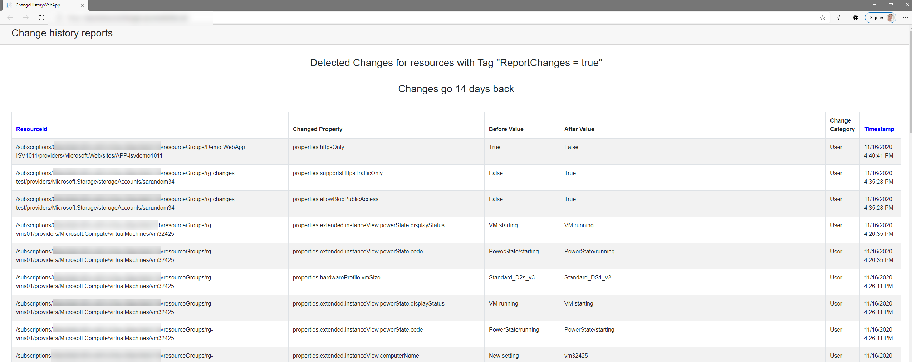

# Azure Resource Change Reports

This App leverages the Resource Changes API (https://docs.microsoft.com/en-us/azure/governance/resource-graph/how-to/get-resource-changes)

Even though the API is still in preview and note all resources report a change, it's still fun to play with and gives you a good insight in what's hapenning in your Azure Subscription. 

### Solution
The solution runs on an Azure Function and an Azure App Service.
The App Service providers the frontend and calls the Azure Function to retrieve all the changes. 

Please note that this function is not 100% solid and is still under development.

Changes are retrieved by querying the Azure Management API for all Resources with the tag "ReportChanging" and value "true". These resourceIds are then ran through the function and against the resource changes API. This results in all registered changes for that specific resource Id during the last 14 days (max amount of days). With large data sets this might have to be tweaked to have an acceptable load time. 

Currently working on implementing a database solution for long term storage and faster responses in the frontend.

### Requirements
- Azure Function with Managed Identity configured
- Managed Identity has permissions on the subscription
- Azure Function CORS configured to allow access from the WebApp

- Azure App Service (Windows, .Net Core)
- App Settings configured:
    - "AzureFunctionAddress" with value "https://[YOURFUNCTIONAPP].azurewebsites.net/api/GetResourceChanges?code=[FUNCTIONKEY]"
    - "subscriptionID" with value: [YOURSUBID]

Deploy the App (from VS Code for example) and go take a look :)